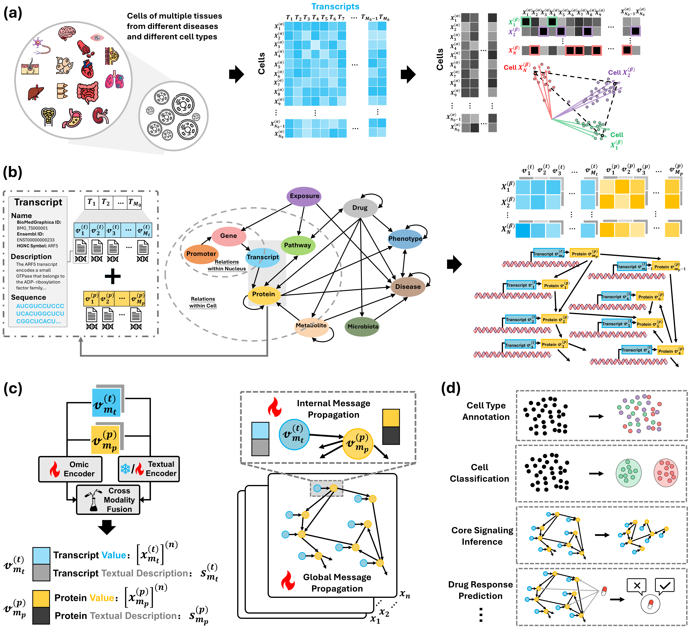

# OmniCellTOSG: The First Text–Omic Dataset and Foundation Model for Single-Cell Signaling Graph Modeling and Analysis

<div align="center">
  
</div>

<div align="center" style="line-height: 1;">
  <!-- GitHub -->
  <a href="https://github.com/FuhaiLiAiLab/OmniCellTOSG" target="_blank" style="margin: 2px;">
    
  </a>

  <!-- Hugging Face Dataset -->
  <a href="https://huggingface.co/datasets/FuhaiLiAiLab/OmniCellTOSG_Dataset" target="_blank" style="margin: 2px;">
    
  </a>
</div>

<div align="center" style="line-height: 1;">
  <!-- arXiv -->
  <a href="https://arxiv.org/abs/2504.02148" target="_blank" style="margin: 2px;">
    
  </a>
  
  <!-- License (update if not MIT) -->
  <a href="LICENSE" style="margin: 2px;">
    
  </a>
</div>

---

OmniCellTOSG is, to our knowledge, the first **cell-level Text–Omic dataset** and companion resources for **signaling-graph modeling and analysis** from single-cell data. It integrates quantitative omics with curated textual/semantic annotations to enable graph-language foundation model training, retrieval, and explainable analysis across organs, tissues, cell types, and disease contexts.

<div align="center">
  
</div>

The human body consists of approximately 37 trillion cells, all originating from a single embryonic cell and sharing the same copy of genome. The complex, robust and accurate cell signaling systems, regulated by varying abundance of proteins and their interactions, create diverse cell types with different functions at different organs. The cell signaling systems are evolved and altered by many factors, inlcuding age, sex, diet, environment exposures and diseases. However, the interaction of a multitude of genes and proteins in conjunction introduces complexity in decoding cell signaling systems or patterns in normal development or diseases. The recent advent in the open-source availability of millions of single cell omic data has presented the unique opportunity to integrate multiple layers from the central dogma of molecular biology, for each individual, to unravel how these multi-omic interactions contribute to disease morbidity. Moreover, inspired by the success of foundation models pre-trained on large corpora (e.g., large language models (LLMs) and large vision models (LVMs)), we introduce, to our knowledge, the first dataset of cell-level Text–Omic Signaling Graphs (TOSGs), OmniCellTOSG, together with a unified graph–language foundation model (GLFM), CellTOSG_Foundation (GLFM). In OmniCellTOSG, each TOSG encodes the signaling system of an individual cell or meta-cell and is paired with contextual labels (organ, disease, sex, age, and cell subtype), enabling scalable pretraining and downstream inference over cellular signaling. In sum, we have three major contributions: (i) a Text–Omic Signaling Graph (TOSG) data model that unifies human-interpretable textual priors (functions, locations, pathways, diseases, drugs) with quantitative single-cell measurements, enabling graph interpretation over cell signaling; (ii) a large-scale, training-ready resource built from about 120 millions scRNA-seq cells across diverse tissues and states, packaged in a PyTorch-native format and supported by a rigorous query–loading–balancing pipeline that yields stratified, unbiased cohorts (by tissue, cell type, disease, age, gender, and condition); and (iii) a joint LLM+GNN foundation-model paradigm that fuses language and graph encoders to propagate textual knowledge with omic signals on TOSGs, enabling tasks such as cell-type annotation, classification, signaling inference. Together, OmniCellTOSG provides both the data substrate and modeling framework to accelerate accurate, interpretable decoding of cellular signaling for life sciences and precision medicine.

---

## ⬇️ Download the OmniCellTOSG Dataset
Get the full dataset on HuggingFace: **[OmniCellTOSG_Dataset](https://huggingface.co/datasets/FuhaiLiAiLab/OmniCellTOSG_Dataset)**

---

## 🗂️ Dataset Layout
```
OmniCellTOSG_Dataset/
├── expression_matrix/
│ ├── braincellatlas_brain_part_0.npy
│ ├── braincellatlas_brain_part_1.npy
│ ├── cellxgene_blood_part_0.npy
│ ├── cellxgene_blood_part_1.npy
│ ├── cellxgene_lung_part_0.npy
│ ├── cellxgene_small_intestine_part_0.npy
│ └── ... (additional *.npy shards)
├── cell_metadata_with_mappings.csv
├── edge_index.npy
├── s_bio.csv
├── s_desc.csv
├── s_name.csv
├── x_bio_emb.npy
├── x_desc_emb.npy
└── x_name_emb.csv
```

> **Notes**
> - Files in `expression_matrix/*.npy` are **sharded partitions** of single-cell expression matrices; merge shards (concatenate/stack) to reconstruct the full matrix for a given source/organ.
> - `cell_metadata_with_mappings.csv` contains **standardized per-cell annotations** (e.g., tissue, disease, sex, cell type, ontology mappings) used by the loaders.
> - `edge_index.npy`, `s_bio.csv`, `s_name.csv`, and `s_desc.csv` provide the **graph topology** (COO `[2, E]`) and **entity metadata** (biological sequences, entity names, and entity descriptions) consumed during training/evaluation.
> - `x_bio_emb.npy`, `x_desc_emb.npy`, and `x_name_emb.csv` are **precomputed entity embeddings** aligned row-wise to `s_bio.csv`, `s_desc.csv`, and `s_name.csv`, respectively. Load these directly (`[#entities × D]`, encoder-dependent) to **skip on-the-fly embedding** of the CSVs.

---

## ⚙️ Dataset Loader Package Installation
```bash
pip install git+https://github.com/FuhaiLiAiLab/OmniCellTOSG
```

---

## 🐍 Loading Data in Python

```python
from CellTOSG_Loader import CellTOSGDataLoader

# --- Build loader (uses your argparse `args`) ---
conditions = {
    "tissue_general": args.tissue_general,
    "disease_name": args.disease_name,   # or: "disease": args.disease_name
    # "suspension_type": args.suspension_type,
    # "cell_type": args.cell_type,
    # "gender": args.gender,
}

dataset = CellTOSGDataLoader(
    root=args.dataset_root,
    conditions=conditions,
    downstream_task=args.downstream_task,     # "disease" | "gender" | "cell_type"
    label_column=args.label_column,           # e.g., "disease" / "gender" / "cell_type"
    sample_ratio=args.sample_ratio,           # or use sample_size for absolute count
    sample_size=args.sample_size,
    balanced=args.balanced,                   # class-balance by priority labels
    shuffle=args.shuffle,
    random_state=args.random_state,
    train_text=args.train_text,               # False → return precomputed name/desc embeddings
    train_bio=args.train_bio,                 # False → return precomputed sequence embeddings
    output_dir=args.dataset_output_dir,
)

# --- Access tensors/arrays ---
x_all   = dataset.data                                # dict of feature arrays (e.g., x_name_emb / x_desc_emb / x_bio_emb)
y_all   = dataset.labels                              # target labels aligned to rows
all_edge_index = dataset.edge_index                   # full graph (COO [2, E])
internal_edge_index = dataset.internal_edge_index     # optional transcript–protein edges
ppi_edge_index = dataset.ppi_edge_index               # optional PPI edges     
x_name_emb, x_desc_emb, x_bio_emb = pre_embed_text(args, dataset, pretrain_model, device) # Prepare text and seq embeddings
```

### 🔧 Parameters (`CellTOSGDataLoader`)
- **root** *(str, required)* — Filesystem path to the dataset root (e.g., `/path/to/OmniCellTOSG_Dataset`).
- **conditions** *(dict, required)* — Row filters over cell metadata  
  (e.g., `{"tissue_general": "brain", "disease_name": "Alzheimer's Disease"}`).
- **downstream_task** *(str, required)* — `"disease"` | `"gender"` | `"cell_type"`.
- **label_column** *(str, required)* — Target label column (e.g., `"disease"`, `"gender"`, `"cell_type"`).
- **sample_ratio** *(float, optional)* — Fraction of rows to sample (0–1). Mutually exclusive with `sample_size`.
- **sample_size** *(int, optional)* — Absolute number of rows to sample. Mutually exclusive with `sample_ratio`.
- **balanced** *(bool, default: `False`)* — Enable class-balancing using task-specific priority labels.
- **shuffle** *(bool, default: `False`)* — Shuffle rows during sampling/composition.
- **random_state** *(int, default: `42`)* — Seed for reproducibility.
- **train_text** *(bool, default: `False`)* — If `False`, return precomputed name/desc embeddings; if `True`, return raw text (`s_name`, `s_desc`) for custom embedding.
- **train_bio** *(bool, default: `False`)* — If `False`, return precomputed sequence embeddings; if `True`, return raw sequences (`s_bio`) for custom embedding.
- **output_dir** *(str, optional)* — Directory for loader-generated artifacts (splits, logs, cached subsets).

> **Returns** (typical):
> - `x, y`: features and labels for the selected split  
> - `edge_index`, `internal_edge_index`, `ppi_edge_index`: graph topological information  
> - Either raw text/sequence fields (`s_name`, `s_desc`, `s_bio`) **or** their precomputed embeddings (`x_name_emb`, `x_desc_emb`, `x_bio_emb`), returned according to the `train_text`/`train_bio` flags.

---

## 🌐 Pretrain the Graph Foundation Model
### 🔗 Edge Prediction (Topology Modeling)
Learn topological patterns and interaction mechanisms:
```bash
python pretrain.py
```

---

## 🚀 Downstream Tasks
### 1) Disease Status Classification
Specify the downstream task and data-loading parameters using the **`CellTOSG_Loader`** package (as invoked in **`train.py`**). Then configure the model hyperparameters to tune performance for your experiment.

```bash
# Alzheimer's Disease (Take AD as an example)
python train.py \
  --downstream_task disease \
  --label_column disease \
  --tissue_general brain \
  --disease_name "Alzheimer's Disease" \
  --sample_ratio 0.1 \
  --train_base_layer gat \
  --train_lr 0.0005 \
  --train_batch_size 3 \
  --train_test_random_seed 42 \
  --dataset_output_dir ./Output/data_ad_disease_0.1
```


### 2) Gender Classification
```bash
# Alzheimer's Disease (Take AD as an example)
python train.py \
  --downstream_task gender \
  --label_column gender \
  --tissue_general brain \
  --disease_name "Alzheimer's Disease" \
  --sample_ratio 0.1 \
  --train_base_layer gat \
  --train_lr 0.0005 \
  --train_batch_size 2 \
  --train_test_random_seed 42 \
  --dataset_output_dir ./Output/data_ad_gender_0.1

```


### 3) Cell Type Annotation
```bash
# Lung (LUAD) (Take LUAD as an example)
python train.py \
  --downstream_task cell_type \
  --label_column cell_type \
  --tissue_general "lung" \
  --disease_name "Lung Adenocarcinoma" \
  --sample_ratio 0.2 \
  --train_base_layer gat \
  --train_lr 0.0001 \
  --train_batch_size 3 \
  --train_test_random_seed 42 \
  --dataset_output_dir ./Output/data_luad_celltype_0.2
```


### 4) Signaling Inference
```bash
python analysis.py
```

## 📜 Citation
If you use this dataset or codebase, please cite:

```bibtex
@article{zhang2025omnicelltosg,
  title     = {OmniCellTOSG: The First Cell Text-Omic Signaling Graphs Dataset for Joint LLM and GNN Modeling},
  author    = {Zhang, Heming and Xu, Tim and Cao, Dekang and Liang, Shunning and Schimmelpfennig, Lars and Kaster, Levi and Huang, Di and Cruchaga, Carlos and Li, Guangfu and Province, Michael and others},
  journal   = {arXiv preprint arXiv:2504.02148},
  year      = {2025}
}
```

---

## 📋 License and Contributions
This project is licensed under the **[MIT License](LICENSE)**, which permits reuse, modification, and distribution for both commercial and non-commercial purposes, provided that the original license is included with any copies of the code.

Contributions are welcome! Please open an issue or submit a pull request following the repository’s contribution guidelines.

