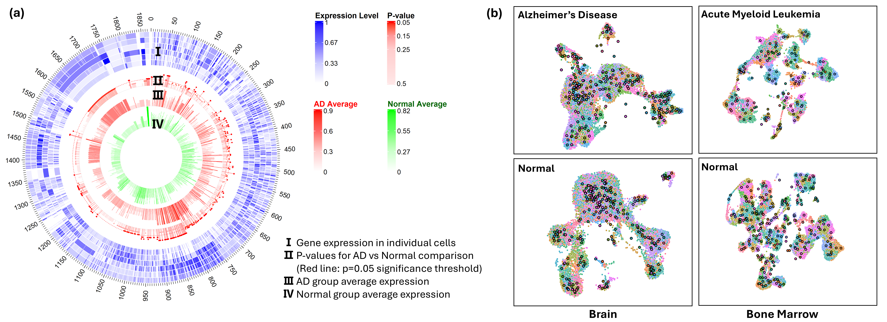
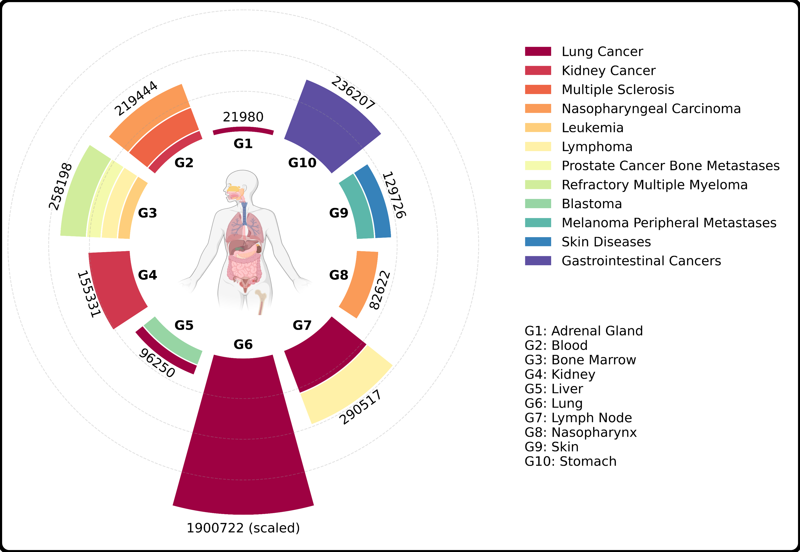

# OmniCellTOSG: The First Cell Text-Omic Signaling Graphs Dataset for Joint LLM and GNN Modeling


The human body consists of approximately 37 trillion cells, all originating from a single embryonic cell and sharing the same copy of genome. The complex, robust and accurate cell signaling systems, regulated by varying abundance of proteins and their interactions, create diverse cell types with different functions at different organs. The cell signaling systems are evolved and altered by many factors, like age, sex, diet, environment exposures and diseases. However, it remains an open problem to decode cell signaling systems or patterns in normal development or diseases because the systems are rather complex consists of tens of thousands of genes/proteins and massive interactions among them. Recently, hundreds of millions of single cell omic data have been being generated by many research projects, which provide the solid basis for understanding cell signaling systems, like the key genes/proteins and their signaling interactions, within diverse cell-subpopulations in different conditions. Moreover, inspired by the success of foundation models that are pre-trained on massive datasets, like large language models (LLMs) and large vision models (LVMs), in this study, we build the first dataset of cell text-omic signaling graphs (TOSGs), named OmniCellTOSG. Each TOSG represents the signaling graph/system of an individual cell or meta-cell, and associated with labels, like organ, disease, sex, age, cell-subtype. The unique contributions of the OmniCellTOSG are two-folds. First, the TOSGs represents a novel and ideal graph data model for decoding cell signaling systems via graph reasoning by incorporating human-understandable textual annotation/prior knowledge (like biological functions, cellular locations, related signaling pathways, related diseases and drugs), with numeric values (that represent the observed abundance levels genes/proteins) in different cells in different organs and conditions. Also new paradigm-shift data analysis models like the joint LLM and GNN models are needed to analyze the TOSGs. Secondly, OmniCellTOSG consists of large-scale cell text-omic signaling graphs, using single cell RNAseq (scRNAseq) data from ~120 millions cells from diverse tissues/organs, health vs diseases. The OmniCellTOSG data are structured in a format that is fully compatible with PyTorch, and can facilitate the development of novel joint LLM and graph neural network (GNN) foundation cell signaling models for decoding the complex cell signaling systems via TOSG graph reasoning. It could shift the paradigm in life sciences, healthcare and precision medicine research.

## 1. Download Raw Data
(including 1. data introduction; 2. download links (need to give the hyperlink to repo if necessary), hopefully code for downloading the resources) for all of the following resources
### 1.1 CellXGene


### 1.2 Brain Cell Atlas

### 1.3 Gene Expression Omnibus (GEO)

### 1.4 Seattle Alzheimer's Disease Brain Cell Atlas (SEA-AD)


## 2. Preprocessing Data
(convert the h5 files into h5ad files)
(cell type annotation)
(cell type clustering, tissue/organ, disease clustering details)

## 3. Meta-cell Generation
### 3.1 Meta-cell generation
(give the running code, and the bash command)


(Observation of Meta-cell Expression Distributions and Clustering Patterns)


### 3.2 Files organization

<p align="center">
  
</p>

(brief overview of the distribution over organs)


## 4. CellTOSGDataset Package Usage
### 4.1 Download the data from the box folder
(provide the download link)

### 4.2 Install the package
```

```

### 4.3 Dataset content
```
-CellTOG
    - S_name.csv (2 columns, BioMedGraphica_ID, Processed_name)
    - S_desc.csv (2 columns, BioMedGraphica_ID, Description)
    - S_bio.csv (2 columns, BioMedGraphica_ID, Sequence)
    - edge_index.npy
    - internal_edge_index.npy
    - ppi_edge_index.npy

    - (folders under organs)
    - Brain
    - Lung
    - Kidney
    - ...
```

### 4.4 Import Dataset

```python
import CellTOSGDataset

x, y, edge_index, internal_edge_index, ppi_edge_index, s_name, s_desc, s_bio =  CellTOSGDataset(root="path", categories=["get_organ", "get_disease", "get_organ_disease"], name = "brain" / "AD" / "brain-AD", label_type = "ct" / "og" / "ds" / "status", seed = 2025, ratio = 0.01, train_text = False, train_bio = False, shffule = True)

if train_text == False:
    return x_name_emb, x_desc_emb
else:
    return s_name, s_desc

if train_bio == False: 
    return x_bio_emb
else:
    return s_bio
```

* instructions with the parameters details and example


## 5. Pretraining CellTOSG_Foundation

```python
def glm(data = Dataset, graph_encoder = 'GCN' / 'GAT' / 'UniMP', text_language_encoder = 'BERT', seq_encoder = ['A', 'B', 'C'])

    return model, loss, acc, pred

```

## 6. Downstream Tasks
### 6.1 Disease status classification
