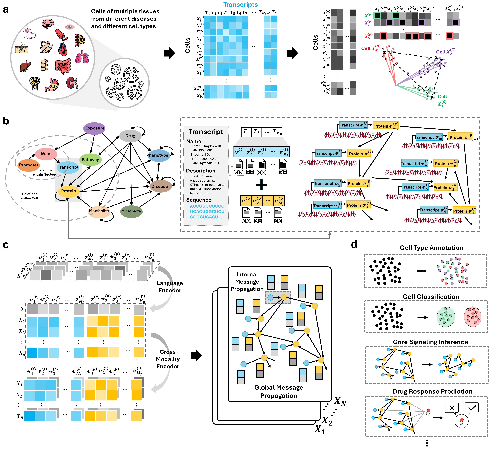

# OmniCellTOSG: The First Text–Omic Dataset and Foundation Model for Single-Cell Signaling Graph Modeling and Analysis

<div align="center">
  
</div>

<div align="center" style="line-height: 1;">
  <!-- GitHub -->
  <a href="https://github.com/FuhaiLiAiLab/OmniCellTOSG" target="_blank" style="margin: 2px;">
    
  </a>

  <!-- Hugging Face Dataset -->
  <a href="https://huggingface.co/datasets/FuhaiLiAiLab/OmniCellTOSG_Dataset" target="_blank" style="margin: 2px;">
    
  </a>
</div>

<div align="center" style="line-height: 1;">
  <!-- arXiv -->
  <a href="https://arxiv.org/abs/2504.02148" target="_blank" style="margin: 2px;">
    
  </a>
  
  <!-- License (update if not MIT) -->
  <a href="LICENSE" style="margin: 2px;">
    
  </a>
</div>

---

OmniCellTOSG is, to our knowledge, the first **cell-level Text–Omic dataset** and companion resources for **signaling-graph modeling and analysis** from single-cell data. It integrates quantitative omics with curated textual/semantic annotations to enable graph-language foundation model training, retrieval, and explainable analysis across organs, tissues, cell types, and disease contexts.

<div align="center">
  
</div>

The human body contains ~37.2 trillion cells that share the same genomic blueprint yet manifest diverse phenotypes through signaling programs governed by protein abundance and interactions. These programs shift with age, sex, diet, environmental exposures, and disease, complicating the decoding of multi-gene and multi-protein effects.

Large-scale foundation models show that pretraining on vast corpora yields transferable representations; in cellular biology, this motivates fusing numerical omic signals with biological priors expressed in text (transcription start sites, functions, mechanisms, etc.), where LLMs can augment graph representation learning by injecting structured prior knowledge.

Here, we introduce a data format, **Text–Omic Signaling Graphs (TOSGs)**, which unifies textual biological priors with numerical omic evidence to enable graph-based interpretation of cell signaling.

We then construct **OmniCellTOSG**, a biomedical AI infrastructure integrating ~80M sc/snRNA-seq cells. To streamline pretraining, we develop **CellTOSG_Loader**, a query–loading–balancing pipeline that yields stratified, unbiased cohorts in Numpy-ready format.

Using these resources, we pretrain a multi-modal graph–language foundation model (**CellTOSG-FM**) that integrates textual priors with omic signals on TOSGs and supports downstream tasks — cell-type annotation, disease classification, and signaling inference with interpretable graph rationales.

---

## ⬇️ Download the OmniCellTOSG Dataset
Get the full dataset on HuggingFace: **[OmniCellTOSG_Dataset](https://huggingface.co/datasets/FuhaiLiAiLab/OmniCellTOSG_Dataset)**


With an environment with HF CLI,
```
huggingface-cli download FuhaiLiAiLab/OmniCellTOSG_Dataset --repo-type dataset --local-dir ./OmniCellTOSG_Dataset_localloader --local-dir-use-symlinks False
```
---

## 🗂️ Dataset Layout
```
OmniCellTOSG_Dataset/
├── expression_matrix/
│ ├── braincellatlas_brain_part_0.npy
│ ├── braincellatlas_brain_part_1.npy
│ ├── cellxgene_blood_part_0.npy
│ ├── cellxgene_blood_part_1.npy
│ ├── cellxgene_lung_part_0.npy
│ ├── cellxgene_small_intestine_part_0.npy
│ └── ... (additional *.npy shards)
├── cell_metadata_with_mappings.csv
├── edge_index.npy
├── s_bio.csv
├── s_desc.csv
├── s_name.csv
├── x_bio_emb.npy
├── x_desc_emb.npy
└── x_name_emb.csv
```

> **Notes**
> - Files in `expression_matrix/*.npy` are **sharded partitions** of single-cell expression matrices; merge shards (concatenate/stack) to reconstruct the full matrix for a given source/organ.
> - `cell_metadata_with_mappings.csv` contains **standardized per-cell annotations** (e.g., tissue, disease, sex, cell type, ontology mappings) used by the loaders.
> - `edge_index.npy`, `s_bio.csv`, `s_name.csv`, and `s_desc.csv` provide the **graph topology** (COO `[2, E]`) and **entity metadata** (biological sequences, entity names, and entity descriptions) consumed during training/evaluation.
> - `x_bio_emb.npy`, `x_desc_emb.npy`, and `x_name_emb.csv` are **precomputed entity embeddings** aligned row-wise to `s_bio.csv`, `s_desc.csv`, and `s_name.csv`, respectively. Load these directly (`[#entities × D]`, encoder-dependent) to **skip on-the-fly embedding** of the CSVs.

---

## ⚙️ Use the Dataset Loader Only
If you only need dataset loading/extraction, clone the standalone loader repo:
```bash
git clone https://github.com/CallOfDady/CellTOSG_Loader CellTOSG_Loader
```

---

## 🐍 Loading Data in Python

```python
from CellTOSG_Loader import CellTOSGDataLoader

# --- Build loader (uses your argparse `args`) ---
conditions = {
    "tissue_general": args.tissue_general,
    "disease_name": args.disease_name,   # or: "disease": args.disease_name
    # "suspension_type": args.suspension_type,
    # "cell_type": args.cell_type,
    # "gender": args.gender,
}

dataset = CellTOSGDataLoader(
    root=args.dataset_root,
    conditions=conditions,
    task=args.task,                          # "disease" | "gender" | "cell_type"
    label_column=args.label_column,          # "disease" | "gender" | "cell_type"
    sample_ratio=args.sample_ratio,          # mutually exclusive with sample_size
    sample_size=args.sample_size,
    shuffle=args.shuffle,
    stratified_balancing=args.stratified_balancing,
    extract_mode=args.extract_mode,          # "inference" | "train"
    random_state=args.random_state,
    train_text=args.train_text,
    train_bio=args.train_bio,
    correction_method=args.correction_method, # None | "combat_seq"
    output_dir=args.output_dir,
)

# --- Access outputs ---
if args.extract_mode == "inference":
    X = dataset.data                         # pandas.DataFrame (expression/features)
    y = dataset.labels                       # pandas.DataFrame
    metadata = dataset.metadata              # pandas.DataFrame (row-aligned metadata)
else:
    X = dataset.data                         # dict: {"train": X_train, "test": X_test}
    y = dataset.labels                       # dict: {"train": y_train, "test": y_test}
    metadata = dataset.metadata              # dict: {"train": meta_train, "test": meta_test}

all_edge_index = dataset.edge_index                   # full graph (COO [2, E])
internal_edge_index = dataset.internal_edge_index     # optional transcript–protein edges
ppi_edge_index = dataset.ppi_edge_index               # optional PPI edges     
x_name_emb, x_desc_emb, x_bio_emb = pre_embed_text(args, dataset, pretrain_model, device) # Prepare text and seq embeddings
```

### 🔧 Parameters (`CellTOSGDataLoader`)
- **root** *(str, required)* — Filesystem path to the dataset root (e.g., `../OmniCellTOSG/CellTOSG_dataset_v2`).
- **conditions** *(dict, required)* — Metadata filters used to subset rows  
  (e.g., `{"tissue_general": "brain", "disease": "Alzheimer's disease"}`).
- **task** *(str, required)* — Downstream task type: `"disease"` | `"gender"` | `"cell_type"`.
- **label_column** *(str, required)* — Target label column (e.g., `"disease"`, `"gender"`, `"cell_type"`).
- **extract_mode** *(str, required)* — Extraction mode:  
  - `"inference"`: extract a single dataset for inference/analysis (no train/test split)  
  - `"train"`: extract a training-ready dataset and generate splits (e.g., train/test)
- **sample_ratio** *(float, optional)* — Fraction of rows to sample (0–1). Mutually exclusive with `sample_size`.
- **sample_size** *(int, optional)* — Absolute number of rows to sample. Mutually exclusive with `sample_ratio`.
- **shuffle** *(bool, default: `False`)* — Shuffle rows during sampling/composition.
- **stratified_balancing** *(bool, default: `False`)* — Enable stratified sampling / class balancing based on `label_column`.
- **random_state** *(int, default: `2025`)* — Random seed for reproducibility (sampling, shuffling, splitting).
- **train_text** *(bool, default: `False`)* — Controls text feature output:  
  - `False`: return precomputed text embeddings (if available)  
  - `True`: return raw text fields for custom embedding
- **train_bio** *(bool, default: `False`)* — Controls biological sequence feature output:  
  - `False`: return precomputed sequence embeddings (if available)  
  - `True`: return raw sequences for custom embedding
- **correction_method** *(str or None, default: `None`)* — Correction method:  
  - `None`: no correction  
  - `"combat_seq"`: apply ComBat-Seq
- **output_dir** *(str, optional)* — Directory for loader outputs (extracted expression matrix, label，splits).

> **Returns** (typical):
> - `extract_mode="inference"`:  
>   - `dataset.data`: `pandas.DataFrame`  
>   - `dataset.labels`: `pandas.DataFrame`  
>   - `dataset.metadata`: `pandas.DataFrame`
> - `extract_mode="train"`:  
>   - `dataset.data`: `dict` (`{"train": X_train, "test": X_test}`)  
>   - `dataset.labels`: `dict` (`{"train": y_train, "test": y_test}`)  
>   - `dataset.metadata`: `dict` (`{"train": meta_train, "test": meta_test}`)
> - `edge_index`, `internal_edge_index`, `ppi_edge_index`: graph topological information  
> - Either raw text/sequence fields (`s_name`, `s_desc`, `s_bio`) **or** their precomputed embeddings (`x_name_emb`, `x_desc_emb`, `x_bio_emb`), returned according to the `train_text`/`train_bio` flags.

---

## 🌐 Pretrain the Graph Foundation Model
### 🔗 Edge Prediction (Topology Modeling)
Learn topological patterns and interaction mechanisms:
```bash
python pretrain.py
```

---

## 🚀 Downstream Tasks
### 1) Disease Status Classification
Specify the downstream task and data-loading parameters using the **`CellTOSG_Loader`** package (as invoked in **`train.py`**). Then configure the model hyperparameters to tune performance for your experiment.

```bash
# Alzheimer's Disease (Take AD as an example)
python train.py \
  --downstream_task disease \
  --label_column disease \
  --tissue_general brain \
  --disease_name "Alzheimer's Disease" \
  --sample_ratio 0.1 \
  --train_base_layer gat \
  --train_lr 0.0005 \
  --train_batch_size 3 \
  --train_test_random_seed 42 \
  --dataset_output_dir ./Output/data_ad_disease_0.1
```


### 2) Gender Classification
```bash
# Alzheimer's Disease (Take AD as an example)
python train.py \
  --downstream_task gender \
  --label_column gender \
  --tissue_general brain \
  --disease_name "Alzheimer's Disease" \
  --sample_ratio 0.1 \
  --train_base_layer gat \
  --train_lr 0.0005 \
  --train_batch_size 2 \
  --train_test_random_seed 42 \
  --dataset_output_dir ./Output/data_ad_gender_0.1

```


### 3) Cell Type Annotation
```bash
# Lung (LUAD) (Take LUAD as an example)
python train.py \
  --downstream_task cell_type \
  --label_column cell_type \
  --tissue_general "lung" \
  --disease_name "Lung Adenocarcinoma" \
  --sample_ratio 0.2 \
  --train_base_layer gat \
  --train_lr 0.0001 \
  --train_batch_size 3 \
  --train_test_random_seed 42 \
  --dataset_output_dir ./Output/data_luad_celltype_0.2
```


### 4) Signaling Inference
```bash
python analysis.py
```

## 📜 Citation
If you use this dataset or codebase, please cite:

```bibtex
@article{zhang2025omnicelltosg,
  title     = {OmniCellTOSG: The First Cell Text-Omic Signaling Graphs Dataset for Joint LLM and GNN Modeling},
  author    = {Zhang, Heming and Xu, Tim and Cao, Dekang and Liang, Shunning and Schimmelpfennig, Lars and Kaster, Levi and Huang, Di and Cruchaga, Carlos and Li, Guangfu and Province, Michael and others},
  journal   = {arXiv preprint arXiv:2504.02148},
  year      = {2025}
}
```

---

## 📋 License and Contributions
This project is licensed under the **[MIT License](LICENSE)**, which permits reuse, modification, and distribution for both commercial and non-commercial purposes, provided that the original license is included with any copies of the code.

Contributions are welcome! Please open an issue or submit a pull request following the repository’s contribution guidelines.

